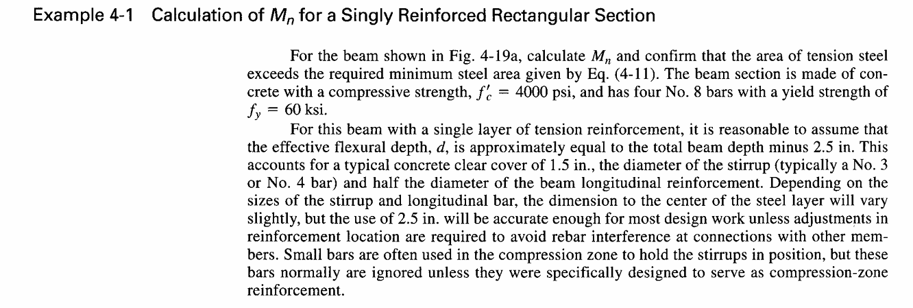
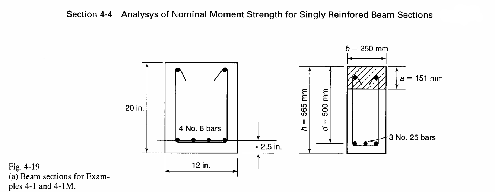
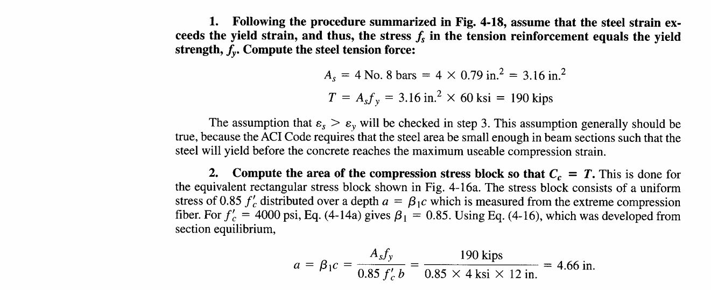
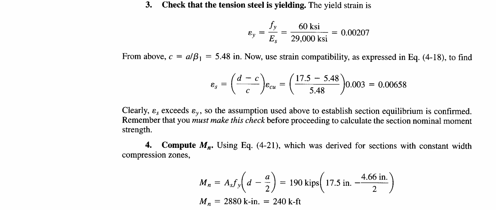
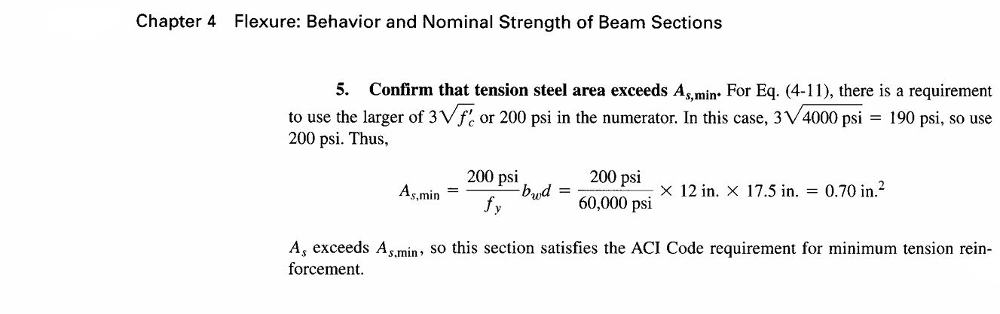
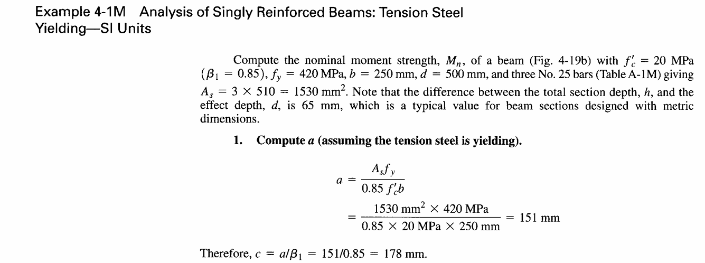
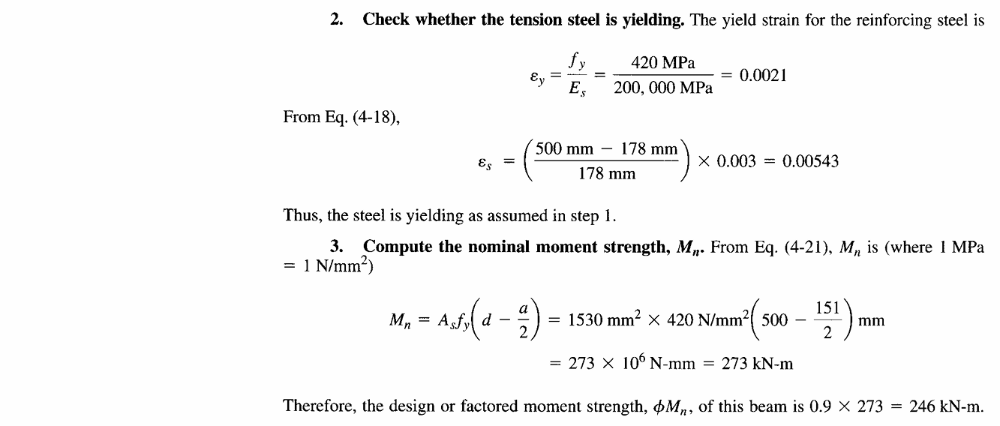
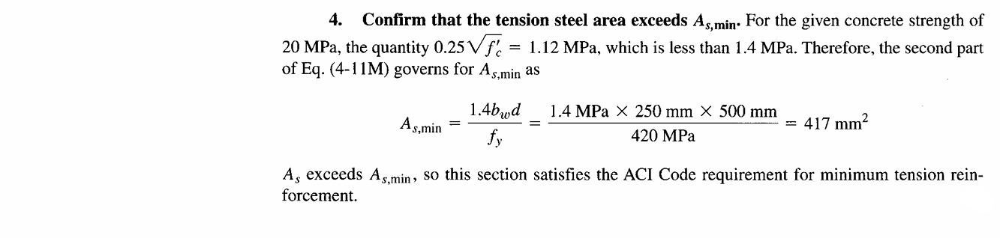

# ML-RBC: Beam Analysis App

A MATLAB application for calculating the **Nominal Moment Strength (Mn)** of singly reinforced concrete beam sections, based on ACI 318 code provisions.


---


---

## Features

- **Interactive GUI** - Real-time visualization as you adjust parameters
- **Dual Unit Support** - Switch between Imperial (psi, in) and SI (MPa, mm)
- **Visual Diagrams** - Cross-section, strain profile, and stress block
- **Step-by-Step Equations** - Calculations displayed with LaTeX notation
- **Results Summary** - Key values displayed in a dedicated panel

---

## How to Run (Step-by-Step)

### Requirements
- MATLAB R2020a or later

### Method 1: Run from MATLAB Command Window
1. Open MATLAB
2. Navigate to the project folder:
   ```matlab
   cd 'C:\path\to\ML-RBC'
   ```
3. Type and press Enter:
   ```matlab
   BeamAnalysisApp
   ```

### Method 2: Run from MATLAB Editor
1. Open MATLAB
2. In the **Current Folder** panel, navigate to the ML-RBC folder
3. Double-click on `BeamAnalysisApp.m` to open it in the Editor
4. Click the green **Run** button in the Editor toolbar (or press F5)

---

## Using the App

### Step 1: Select Unit System
- Use the toggle switch at the top of the input panel
- **Imperial**: psi, inches (Example 4-1)
- **SI**: MPa, mm (Example 4-1M)

### Step 2: Enter Input Values

| Category | Parameter | Description |
|----------|-----------|-------------|
| **Materials** | fc' | Concrete compressive strength |
| | fy | Steel yield strength |
| | Es | Steel modulus of elasticity |
| | Beta1 | Stress block factor |
| | ecu | Ultimate concrete strain |
| **Geometry** | b | Beam width |
| | h | Total beam depth |
| | d | Effective depth to steel |
| **Reinforcement** | Number of Bars | Count of tension bars |
| | Bar Area | Area per bar |

### Step 3: View Results
The app automatically updates when you change any value:
- **Left diagrams**: Cross section, strain profile, stress block
- **Bottom panel**: Step-by-step equations with your values
- **Results box**: Summary of calculated values

---

## Reference Examples

Based on **Example 4-1** and **Example 4-1M** from ACI 318:

<details>
<summary>Click to view Example 4-1 (Imperial)</summary>







</details>

<details>
<summary>Click to view Example 4-1M (SI)</summary>





</details>

---

## Troubleshooting

| Issue | Solution |
|-------|----------|
| App doesn't open | Ensure MATLAB R2020a+ is installed |
| Blank plots | Check that all input values are positive |
| Run button grayed out | Make sure you're in the correct folder |

---

## Theory Reference

- **ACI 318-19**: Building Code Requirements for Structural Concrete
- **Section 4-4**: Analysis of Nominal Moment Strength
- **Equations**: 4-11, 4-14a, 4-16, 4-18, 4-21

---

## Citation

```bibtex
@software{ML-RBC,
  author = {algorembrant},
  title = {ML-RBC: Beam Analysis Tool in MATLAB},
  year = {2026},
  url = {https://github.com/algorembrant/ML-RBC},
  note = {MATLAB application for nominal moment strength calculation of reinforced concrete beams}
}
```
